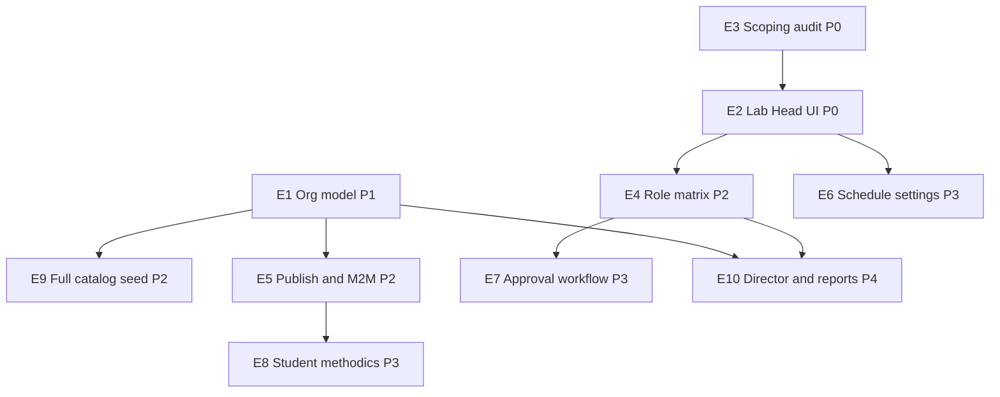

# Gap-анализ: labbooking vs структура СПГУ

> Дата: 29.06.2026  
> Контекст: Django + DRF + PostgreSQL + HTMX; пилотный MVP с scoping по группе/лаборатории/УЦ.

---

## 1. Executive summary

Пилотный MVP покрывает **ядро записи студентов** (группа → учебный план → дисциплины/ЛР → слоты → бронирование) и **операционный контур staff** с scoping по `training_center` / `laboratory`. Модели `TrainingCenter`, `Laboratory`, `Room`, `LabStand`, `Department`, `Discipline`, `LabWork`, `StudentGroup`, роли `LAB_HEAD`/`LAB_ADMIN`/`TEACHER` — в коде и частично в UI.

Главный разрыв с реальностью СПГУ — **организационная иерархия**: нет сущности факультета, группа не привязана к кафедре, лаборатория не привязана к факультету, нет типов лабораторий (межкафедральная/комплексная) и роли «Руководитель лаборатории». В seed и CSV — пилот НГФ (~3 кафедры), не полный каталог 8+1 факультетов.

Второй блок — **матрица прав по ТЗ**: `LAB_ADMIN` и `TEACHER` не разведены (преподаватель может менять статусы записей); нет scoping сотрудника по **аудитории**; нет workflow подтверждения действий сотрудника завлабом.

Третий — **публикация и M2M**: `is_published` есть у дисциплин и ЛР, но не у аудиторий/стендов; ЛР связана с одной `default_room` и одним `primary_stand`, а не с несколькими.

Четвёртый — **расписание и настройки**: backend (`ScheduleEntry`, `generate_sessions`, `mark_visited`) есть, но UI завлаба для **людей** и **расписания** — заглушки «На доработке»; нет недельного календаря, выгрузки, per-lab настроек auto-VISITED и окна записи.

Методички (`LabWork.methodics_file`) загружаются staff, но **студенту не показываются**. Интеграции Деканат/SSO — заглушки; CSV-импорт — рабочий fallback для пилота.

**Вывод:** для узкого пилота (1–2 лаборатории НГФ) достаточно стабилизации данных и восстановления lab-head UI. Для полноценного запуска по ТЗ СПГУ нужны эпики организационной модели, матрицы ролей и расширения scheduling — без переписывания на SPA.

---

## 2. Таблица текущих сущностей

| Сущность / связь | Есть в коде? | Где в коде | Замечания |
|---|---|---|---|
| **Университет** | ❌ | — | Нет модели; подразумевается один вуз |
| **Учебный центр (УЦ)** | ✅ | `scheduling.TrainingCenter` | `number`, `name`; уникальность по номеру |
| **Лаборатория** | ✅ | `scheduling.Laboratory` | FK → `TrainingCenter`; **нет** FK → Faculty, нет типа (межкаф./комплекс.) |
| **Лаборатория → УЦ + факультет** | ⚠️ частично | `Laboratory.training_center` | Организационная принадлежность к факультету **не моделируется** |
| **Факультет** | ⚠️ | `StudentGroup.faculty`, `UserProfile.faculty` — CharField | Нет справочника `Faculty`, нет FK |
| **Кафедра** | ✅ | `academics.Department` | `title`, `short_code`, `ordering`; **нет** FK → Faculty |
| **Группа** | ✅ | `academics.StudentGroup` | M2M `disciplines`, `lab_works`; `faculty` — строка; **нет** FK → Department |
| **Группа → кафедра → факультет** | ❌ | — | Цепочка не реализована |
| **Студент → группа** | ✅ | `UserProfile.student_group`, `resolve_student_group()` | Fallback по `group_name`; scoping в `student_disciplines_qs` / `student_lab_works_qs` |
| **Учебный план группы** | ✅ | `StudentGroup.disciplines`, `.lab_works` | ЛР могут быть в чужих лабораториях через M2M `LabWork.laboratories` |
| **Аудитория** | ✅ | `scheduling.Room` | FK → `TrainingCenter`, опц. → `Laboratory`; `capacity`, `photo`; **нет** `is_published` |
| **Стенд** | ✅ | `scheduling.LabStand` | FK → `TrainingCenter`, `Room`; **нет** `laboratory` FK, **нет** `is_published` |
| **Дисциплина** | ✅ | `academics.Discipline` | FK → `Department`, `Semester`; M2M → labs/TC; `is_published` |
| **Лаб. работа** | ✅ | `academics.LabWork` | M2M disciplines/labs/TC; `default_room` (1), `primary_stand` (1); `is_published`, `methodics_file` |
| **Слот / расписание** | ✅ | `ScheduleEntry`, `LabSession` | Нечёт/чёт, генератор слотов; `teacher` на слоте |
| **Запись / статусы** | ✅ | `bookings.Booking`, `BookingService` | 5 статусов, история, waitlist |
| **STUDENT** | ✅ | `users.UserRole` | Полный student flow |
| **LAB_HEAD (завлаб)** | ✅ | `UserRole`, `views/lab_head.py`, `services/lab_head.py` | Кабинет; часть шаблонов — заглушки |
| **LAB_ADMIN (сотрудник)** | ✅ | `UserRole`, `views/staff.py` | Нет дифференциации прав vs завлаб |
| **TEACHER (преподаватель)** | ✅ | `UserRole` | **Может** менять статусы записей (как staff), в ТЗ — только просмотр |
| **LAB_DIRECTOR (руководитель)** | ❌ | — | Нет роли и UI |
| **Зав. кафедрой / аспирант** | ❌ | — | Нет ролей и должностей |
| **Должность / категория** | ❌ | — | Нет полей в `UserProfile` |
| **Публикация ЛР** | ✅ | `LabWork.is_published` | CRUD завлаба |
| **Публикация дисциплины** | ✅ | `Discipline.is_published` | В staff/lab-head списках |
| **Публикация аудитории** | ❌ | — | Нет флага закрытия брони |
| **Публикация стенда** | ❌ | — | — |
| **ЛР ↔ несколько аудиторий** | ❌ | `default_room` FK | Одна аудитория по умолчанию |
| **ЛР ↔ несколько стендов** | ❌ | `primary_stand` FK | Один стенд; блокировка по `primary_stand_id` в `LabSession` |
| **Approval workflow (сотрудник→завлаб)** | ❌ | — | Нет модели заявок |
| **Окно записи (настройка)** | ⚠️ | `settings.BOOKING_*`, `session_availability.py` | Глобально через env, не per-lab |
| **Auto VISITED** | ⚠️ | `mark_visited` command, cron | Сразу после `ends_at`; нет режимов 22:00/12:00/off per-lab |
| **Недельный календарь расписания** | ❌ UI | `lab_head/schedule.html` — заглушка | Backend create есть, UI отключён |
| **Дежурный на слот** | ⚠️ | `LabSession.teacher`, `ScheduleEntry.teacher` | Только поле teacher; нет отдельного «дежурного сотрудника» |
| **Закрытие слота** | ✅ | `LabSessionStatus.CLOSED/CANCELLED` | Нет UI закрытия отдельного слота в lab-head |
| **Выгрузка расписания** | ❌ | — | Excel только для записей |
| **Методички** | ⚠️ | `LabWork.methodics_file` | Upload staff; **нет** student UI/API |
| **Scoping student_group** | ✅ | `academics/querysets.py`, тесты | — |
| **Scoping laboratory** | ✅ | `staff_lab_filter`, `test_staff_scope.py` | Изоляция sibling labs в одном УЦ |
| **Scoping по аудитории (LAB_ADMIN)** | ❌ | — | Сотрудник видит всю лабораторию |
| **profile.disciplines** | ⚠️ | `UserProfile.disciplines` M2M | Metadata; не security boundary (skill) |
| **CSV / seed** | ✅ | `import_dekanat_csv`, `seed_demo.py`, [csv_templates/README.md](csv_templates/README.md) | Пилот НГФ; groups/faculty — строки |
| **Деканат API / SSO** | ❌ stub | `integrations/dekanat.py`, `SSO_ENABLED` | Post-MVP |

---

## 3. Gap-таблица

| Gap ID | Категория | Текущее состояние | Целевое состояние | Критичность | Риски |
|---|---|---|---|---|---|
| **G-001** | модель | Нет `Faculty`; `faculty` — CharField | Справочник 8+1 факультетов, FK | **P1** | Миграция + backfill из CharField; дубли названий |
| **G-002** | модель | `Department` без faculty | `Department.faculty_id` | **P1** | Перепривязка ~70 кафедр; pilot seed |
| **G-003** | модель | `StudentGroup` без department | `StudentGroup.department_id` → Faculty | **P1** | CSV/import; scoping студентов не ломается |
| **G-004** | модель | `Laboratory` только → УЦ | + `faculty_id`, `lab_type` (regular/interdept/complex) | **P1** | M2M faculty для межкафедр.; backfill по seed |
| **G-005** | права | Нет `LAB_DIRECTOR` | Отдельная роль или расширение `LAB_HEAD` с flag | **P2** | Матрица прав; один комплексный кейс |
| **G-006** | права | Нет зав. кафедрой, аспиранта | Роли `DEPT_HEAD`, `GRAD_STUDENT` (read-only) | **P3** | Вне scope labbooking |
| **G-007** | модель | Нет должности/категории staff | Поля rank/category в профиле | **P2** | Отчёты, UI карточки |
| **G-008** | права | `TEACHER` = полный staff для статусов | Записи — только просмотр; отчёты — да | **P1** | `StaffStatusUpdateWebView`, API; тесты |
| **G-009** | права | `LAB_ADMIN` ≈ `LAB_HEAD` minus create stand | Матрица ТЗ: read-only дисциплины/люди; ограниченное редактирование | **P1** | Рефакторинг mixins/permissions |
| **G-010** | права | Scoping по laboratory, не room | `UserProfile.rooms` M2M; filter bookings по аудитории | **P1** | LAB_ADMIN видит чужие аудитории той же лаб. |
| **G-011** | модель/UI | Нет approval workflow | `StaffChangeRequest` pending→approved | **P2** | Новая модель, уведомления, audit |
| **G-012** | модель | `LabWork.default_room` (1:1) | M2M `rooms`, `stands`; capacity rules | **P1** | `LabSession`, stand blocking, lab_head forms |
| **G-013** | модель | `LabStand` без laboratory FK | FK → Laboratory (denorm from room) | **P2** | Консистентность room↔lab |
| **G-014** | модель/UI | Room без `is_published` | Флаг закрытия брони/публикации | **P1** | `bookable_sessions_qs` filter |
| **G-015** | модель/UI | LabStand без `is_published` | Публикация/снятие стенда | **P2** | Связь с ЛР M2M |
| **G-016** | UI | `lab_head/people.html`, `schedule.html` — заглушки | Полный HTMX UI (есть views/services) | **P0** | Backend готов; шаблоны откатили/не доделали |
| **G-017** | UI | Нет недельного календаря, export schedule | Календарь + Excel/iCal выгрузка | **P2** | Зависит от G-016 |
| **G-018** | эксплуатация | Auto VISITED — глобальный cron сразу после ends_at | Per-lab: 22:00 / 12:00+1 / off | **P2** | `LaboratorySettings` или JSON на lab |
| **G-019** | эксплуатация | Окно записи — global env | Per-lab override `BOOKING_*` | **P2** | Fallback на global |
| **G-020** | UI | Нет закрытия отдельного слота в lab-head UI | Close slot + duty staff picker | **P2** | `LabSession.status` уже есть |
| **G-021** | UI | ~~Нет «добавить из базы» для staff~~ → форма создания с email/паролем | **Поиск существующего сотрудника + привязка к лаборатории/дисциплинам** (учётная запись уже есть) | **P1** | ~~vs только create в `LabHeadPersonCreateView`~~ → `LabHeadPersonSearchView` + `LabHeadPersonBindView`; создание аккаунтов — вне scope вкладки |
| **G-022** | UI | Нет ручного распределения нагрузки | Workload view по дисциплинам/аудиториям | **P3** | Аналитика, не блокер |
| **G-023** | UI | Студент не видит стенды/ответственного | В booking flow + `booking_detail` | **P2** | `LabSession.teacher`, stands M2M |
| **G-024** | UI/API | Методички только staff upload | Student download если опубликовано | **P2** | ACL: только свои ЛР |
| **G-025** | модель | `generate_lab_work_code` — hardcode `НГФ` | Код из Faculty/Department | **P1** | Существующие codes; migration nullable |
| **G-026** | данные | 3 кафедры НГФ в migration 0008 | Полный каталог СПГУ | **P1** | Seed/fixture, не runtime |
| **G-027** | данные | Pilot: 1 УЦ, 1 lab | ~27 лабораторий по факультетам | **P1** | `seed_demo`, CSV lab_bindings |
| **G-028** | права | `StaffPeopleView` — scope по УЦ, не lab | `staff_lab_filter` / `lab_head_people_qs` | **P0** | Утечка staff между labs в УЦ |
| **G-029** | API | Staff scoping в API в целом OK | Аудит всех list/detail endpoints | **P0** | `test_staff_scope.py` расширить |
| **G-030** | UI | Нет delete/edit stand (только create) | CRUD + unpublish | **P2** | PROTECT on FK |
| **G-031** | интеграция | Dekanat API stub | Live sync groups/curriculum | **P3** | Ownership данных |
| **G-032** | отчёты | Excel без пол/должность/история | Расширенные поля ТЗ | **P2** | `reports.py` |
| **G-033** | UI | Discipline bind/unbind есть; нет faculty-aware migration | UI «перенос ЛР между факультетами» | **P2** | Business rules |
| **G-034** | модель | `LabWork.laboratories.set([one])` в service | M2M несколько labs для межкафедр. ЛР | **P2** | lab_head_update_lab_work |

---

## 4. Эпики с фазами

### E1: Организационная модель СПГУ (L, фаза 1–2)

Faculty → Department → StudentGroup; Laboratory → Faculty + type.

### E2: Восстановление Lab Head UI (M, фаза 1)

`lab_head/people.html`, `schedule.html` — backend уже есть.

**Вкладка «Сотрудники»** — не создание учётных записей (email/пароль уже есть в системе), а **поиск существующего сотрудника/преподавателя и привязка к лаборатории**; дисциплины — отдельно через «Привязки».

### E3: Scoping audit (S, фаза 1)

G-028, G-029 — staff people по laboratory.

### E4: Матрица ролей LAB_ADMIN / TEACHER / LAB_HEAD (L, фаза 2)

Room-level scoping, TEACHER read-only bookings.

### E5: Публикация и M2M ресурсов ЛР (L, фаза 2)

Room/Stand publish; LabWork ↔ rooms/stands M2M.

### E6: Расписание и operational settings (XL, фаза 3)

Календарь, per-lab booking/VISITED, export.

### E7: Approval workflow (L, фаза 3)

`StaffChangeRequest`.

### E8: Студент — методички и информирование (M, фаза 3)

### E9: Данные и импорт полного каталога (M, фаза 2)

### E10: LAB_DIRECTOR и расширенные отчёты (M, фаза 4)

| Фаза | Фокус | Эпики |
|---|---|---|
| **1** | Пилот без регрессий | E3, E2, начало E1 |
| **2** | Полноценный запуск | E1, E9, E4, E5 |
| **3** | Операционная зрелость | E6, E7, E8 |
| **4** | Nice-to-have | E10 |

---

## 5. Рекомендации по модели данных

1. **Faculty** — да, FK вместо CharField; backfill из `StudentGroup.faculty`.
2. **StudentGroup → Department → Faculty** — FK-цепочка; scoping студента оставить по M2M учебного плана.
3. **Laboratory → Faculty** — `lab_type` + `faculty_id` / M2M для межкафедральных.
4. **LAB_DIRECTOR** — отдельная роль или flag на профиле; единичный кейс.
5. **LabWork ↔ Room/Stand** — M2M с миграцией из `default_room` / `primary_stand`.
6. **Approval** — модель `StaffChangeRequest` (PENDING/APPROVED/REJECTED), inbox завлаба.

---

## 6. Что НЕ делать сейчас

Декан, SSO, API Деканата, SPA, интерактивная карта, waitlist как продукт, полная HR-иерархия, scoping по faculty вместо laboratory.

---

## 7. Первые 3 задачи (рекомендация)

1. **G-028** — `StaffPeopleView` scoping по laboratory (`staff.py`, `test_staff_scope.py`).
2. **G-016** — восстановить `lab_head/people.html`, `lab_head/schedule.html`.
3. **G-001/G-002** — модель `Faculty`, FK на `Department`, backfill.

---

## Связанные документы

- [CHANGELOG_GAP_PHASE1_2026-06-29.md](CHANGELOG_GAP_PHASE1_2026-06-29.md) — реализованные изменения фазы 1
- [ROADMAP.md](ROADMAP.md)
- [PILOT_PLAN.md](PILOT_PLAN.md)
- [POST_PILOT_ROADMAP.md](POST_PILOT_ROADMAP.md)
- [LAB_HEAD_UI_EXPLAINED.md](LAB_HEAD_UI_EXPLAINED.md)
- Skill: `.cursor/skills/labbooking-access-scope/SKILL.md`
