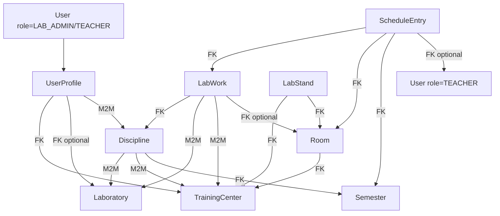
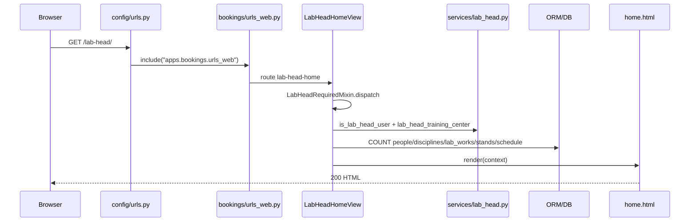

# Lab Head UI: полный разбор

Документ объясняет, как устроен кабинет заведующего лабораторией (`LAB_HEAD`) в репозитории labbooking — от входа пользователя в браузере до SQL-запросов и HTML-ответа.

**Разбираемые файлы (в порядке разбора):**

1. `backend/config/urls.py`
2. `backend/apps/bookings/urls_web.py`
3. `backend/apps/bookings/views/lab_head.py`
4. `backend/apps/bookings/services/lab_head.py`
5. Шаблоны `backend/templates/bookings/lab_head/*.html`
6. `backend/apps/bookings/tests/test_lab_head_ui.py`
7. Связанный контекст: `academics/querysets.py`, `staff_lab_filter`, модели

---

## Часть A. Общая картина

### A.1 Что делает Lab Head UI

`Lab Head UI` — это отдельный серверный кабинет для роли `LAB_HEAD`, где завлаб управляет «своим» контуром: сотрудниками/преподавателями, привязками дисциплин и ЛР к лаборатории, карточками лабораторных работ, стендами и шаблонным расписанием.

Архитектурно это классический Django server-rendered поток: URL → CBV (class-based view) → сервисные функции (scope + фильтрация + валидация) → ORM-запросы → HTML-шаблон.

Ключевая идея безопасности: все чтение/запись должно проходить через scope учебного центра/лаборатории завлаба (`training_center`/`laboratory` из профиля), чтобы нельзя было увидеть или изменить чужие данные.

### A.2 Схема потока запроса

```mermaid
flowchart LR
    A[Browser<br/>GET/POST /lab-head/*] --> B[config/urls.py<br/>include apps.bookings.urls_web]
    B --> C[bookings/urls_web.py<br/>route -> LabHead*View]
    C --> D[LabHeadRequiredMixin.dispatch<br/>auth + role + training_center]
    D --> E[LabHead View method<br/>get_context_data / post]
    E --> F[services/lab_head.py<br/>scope helpers + filters + validators]
    F --> G[Django ORM<br/>SELECT/INSERT/UPDATE/M2M]
    G --> H[Template<br/>bookings/lab_head/*.html]
    H --> I[HTTP response<br/>200/302 + messages]
```



### A.3 Карта модулей

| Файл | Ответственность |
|---|---|
| `backend/config/urls.py` | Корневой роутинг; подключает web-роуты bookings через `include("apps.bookings.urls_web")` |
| `backend/apps/bookings/urls_web.py` | Плоская карта web URL; все `/lab-head/*` endpoints и их `name` |
| `backend/apps/bookings/views/lab_head.py` | HTTP-слой: `dispatch/get/post`, контекст, `messages`, редиректы |
| `backend/apps/bookings/services/lab_head.py` | Scope, queryset'ы, search-фильтры, in-scope проверки, обновление ЛР |
| `backend/templates/bookings/lab_head/*.html` | Отрисовка UI; формы POST с CSRF; клиентский JS для modal UX |
| `backend/apps/bookings/tests/test_lab_head_ui.py` | Интеграционные web-тесты |

**HTMX:** библиотека подключена глобально в `base.html`, но в шаблонах Lab Head **нет** `hx-*` атрибутов — используются обычные формы и `<dialog>` с vanilla JS.

### A.4 Карта URL `/lab-head/*`

| URL | name | View | HTTP methods | Что делает |
|---|---|---|---|---|
| `/lab-head/` | `lab-head-home` | `LabHeadHomeView` | GET | Дашборд с агрегированными счетчиками |
| `/lab-head/people/` | `lab-head-people` | `LabHeadPeopleView` | GET | Список сотрудников/преподавателей (шаблон — заглушка) |
| `/lab-head/people/create/` | `lab-head-person-create` | `LabHeadPersonCreateView` | POST | Создание сотрудника/преподавателя в своем УЦ |
| `/lab-head/people/<pk>/bindings/` | `lab-head-person-bindings` | `LabHeadPersonBindingsView` | POST | Обновление M2M привязок дисциплин сотруднику |
| `/lab-head/bindings/` | `lab-head-bindings` | `LabHeadBindingsView` | GET | Экран привязок дисциплин/ЛР к лаборатории |
| `/lab-head/bindings/disciplines/create/` | `lab-head-discipline-create` | `LabHeadDisciplineCreateView` | POST | Создание дисциплины отключено (редирект с ошибкой) |
| `/lab-head/bindings/disciplines/<pk>/bind/` | `lab-head-discipline-bind` | `LabHeadDisciplineBindView` | POST | Привязка дисциплины к лаборатории |
| `/lab-head/bindings/disciplines/<pk>/unbind/` | `lab-head-discipline-unbind` | `LabHeadDisciplineUnbindView` | POST | Отвязка дисциплины от лаборатории |
| `/lab-head/bindings/lab-works/<pk>/bind/` | `lab-head-lab-work-bind` | `LabHeadLabWorkBindView` | POST | Привязка ЛР к лаборатории |
| `/lab-head/bindings/lab-works/<pk>/unbind/` | `lab-head-lab-work-unbind` | `LabHeadLabWorkUnbindView` | POST | Отвязка ЛР от лаборатории |
| `/lab-head/lab-works/` | `lab-head-lab-works` | `LabHeadLabWorksView` | GET | Список/поиск ЛР, данные для create/edit диалогов |
| `/lab-head/lab-works/create/` | `lab-head-lab-work-create` | `LabHeadLabWorkCreateView` | POST | Создание ЛР с валидацией scope |
| `/lab-head/lab-works/<pk>/update/` | `lab-head-lab-work-update` | `LabHeadLabWorkUpdateView` | POST | Обновление ЛР через сервис |
| `/lab-head/stands/` | `lab-head-stands` | `LabHeadStandsView` | GET | Список/поиск стендов |
| `/lab-head/stands/create/` | `lab-head-stand-create` | `LabHeadStandCreateView` | POST | Создание стенда в своем УЦ |
| `/lab-head/schedule/` | `lab-head-schedule` | `LabHeadScheduleView` | GET | Список расписания (шаблон — заглушка) |
| `/lab-head/schedule/create/` | `lab-head-schedule-create` | `LabHeadScheduleCreateView` | POST | Создание записи расписания |

### A.5 Роли и ограничения доступа

**Кто может зайти**

Входной шлюз: `LabHeadRequiredMixin.dispatch`.

Условия:
1. пользователь аутентифицирован (`LoginRequiredMixin`);
2. роль строго `LAB_HEAD` (`is_lab_head_user`);
3. у профиля определен `training_center` (`lab_head_training_center`).

При нарушении: `messages.error` + `redirect("home")` (для анонимного — redirect на login).

**Где проверяется scope**

| Уровень | Механизм |
|---|---|
| Базовый scope | `resolve_staff_training_center`, `resolve_staff_laboratory` (через `lab_head_training_center` / `lab_head_laboratory`) |
| List/query | `lab_head_people_qs`, `lab_head_rooms_qs`, `lab_head_laboratories_qs`, `lab_head_schedule_qs`, `staff_managed_disciplines_qs`, `staff_managed_lab_works_qs` |
| Object-level | `lab_head_*_in_scope(...)` + `get_object_or_404` на scoped queryset |
| Расписание | `staff_lab_filter` (фильтр по `user.profile.training_center`) |

### A.6 Сущности и связи



**Bindings** в UI — M2M-операции:
- `Discipline.laboratories.add/remove(...)`
- `LabWork.laboratories.add/remove/set(...)`
- `UserProfile.disciplines.set(...)`
- После изменения лабораторий у `Discipline/LabWork` синхронизируется `training_centers` через `sync_training_centers_for_laboratories`.

---

## Часть B. Построчный разбор по файлам

### B.1 `backend/config/urls.py`

**Назначение:** корневая таблица маршрутов Django-проекта. Для Lab Head UI ключевая строка — `path("", include("apps.bookings.urls_web"))`.

**Импорты:**
- `django.contrib.admin`, `django.urls.include/path` — базовый роутинг
- `settings`, `static` — раздача медиа в `DEBUG`
- `drf_spectacular`, `simplejwt` — API (не часть Lab Head web UI)
- `HealthView`, auth views, `favicon` — health/auth/favicon

**Ключевой блок `urlpatterns`:**

```python
path("", include("apps.bookings.urls_web")),
```

- Запрос на `/lab-head/` сначала матчит `config/urls.py`, затем переходит в `bookings/urls_web.py`.
- `path("login/")`, `path("logout/")` — веб-аутентификация; Lab Head защищен `LoginRequiredMixin`.
- Проверок роли/лаборатории в этом файле нет — только маршрутизация.

---

### B.2 `backend/apps/bookings/urls_web.py`

**Назначение:** центральная web-карта маршрутов bookings (student, staff, lab-head).

**Импорты Lab Head view (строки 3–21):** все `LabHead*View` из `apps.bookings.views.lab_head`.

**Lab Head маршруты (строки 116–168):**

- Регистрирует все страницы/действия Lab Head UI.
- Схема REST-подобная на server-rendered UI: `GET` страницы, `POST` мутации.
- URL именованы последовательно (`lab-head-*`) для `redirect()`, ``, `reverse()` в тестах.

---

### B.3 `backend/apps/bookings/views/lab_head.py`

**Назначение:** HTTP-слой Lab Head UI — все `View/ListView/TemplateView`.

**Импорты:**
- `datetime` — парсинг `start_time` в расписании
- `messages`, `LoginRequiredMixin`, `get_object_or_404`, `redirect` — web flow
- `Prefetch`, `ListView`, `TemplateView`, `View` — ORM-оптимизация и CBV
- Модели: `LabWork`, `LabStand`, `ScheduleEntry`, `WeekParity`, `User`, `UserRole`
- Сервисы из `services.lab_head` — scope и бизнес-логика

#### `WEEKDAY_LABELS` (строка 38)

Маппинг индекса `weekday` → русская метка дня. Используется в контексте расписания.

#### `LabHeadRequiredMixin` (строки 41–53)

```python
class LabHeadRequiredMixin(LoginRequiredMixin):
    def dispatch(self, request, *args, **kwargs):
        if not is_lab_head_user(request.user):
            messages.error(request, "Доступ только для заведующего лабораторией.")
            return redirect("home")
        if not lab_head_training_center(request.user):
            messages.error(request, "В профиле не указана лаборатория.")
            return redirect("home")
        return super().dispatch(request, *args, **kwargs)
```

- Гейт для всех Lab Head view: роль `LAB_HEAD` + `training_center` в профиле.
- `get_training_center()` — helper для наследников.

#### `LabHeadHomeView` (строки 55–67)

- `template_name = "bookings/lab_head/home.html"`
- `get_context_data`: `training_center`, счетчики через `lab_head_people_qs`, `staff_managed_disciplines_qs`, `staff_managed_lab_works_qs`, `LabStand.objects.filter(training_center=tc)`, `lab_head_schedule_qs`.

#### `LabHeadPeopleView` (строки 70–85)

- `ListView`, `get_queryset` → `lab_head_people_qs`
- Контекст: `training_center`, `lab_disciplines`, `role_choices` = `[LAB_ADMIN, TEACHER]`
- Шаблон пока заглушка, backend готовит полный контекст.

#### `LabHeadPersonCreateView.post` (строки 88–121)

1. Читает POST: `email`, `first_name`, `last_name`, `role`, `password` (default `"ChangeMe123!"`)
2. Валидирует обязательные поля и роль
3. Проверяет уникальность email
4. `User.objects.create_user(...)`, `profile.training_center = tc`
5. Success message + redirect `lab-head-people`

#### `LabHeadPersonBindingsView.post` (строки 124–133)

- `get_object_or_404(lab_head_people_qs(...), pk=pk)`
- `allowed_ids` через `staff_managed_disciplines_qs(...).filter(pk__in=discipline_ids)`
- `person.profile.disciplines.set(allowed_ids)`

#### `LabHeadBindingsView.get_context_data` (строки 136–174)

- Группирует `bindable_lab_works` по `discipline_id`
- `lab_disciplines` с `select_related("semester")`, `Prefetch("lab_works", ..., to_attr="managed_lab_works")`
- Поиск `q`: Python-фильтр + `title__icontains` для bindable
- Контекст: `training_center`, `laboratory`, `lab_disciplines`, `bindable_disciplines`, `search_query`

#### `LabHeadDisciplineCreateView.post` (строки 177–180)

Всегда error: «Создание дисциплин доступно только в админке.» + redirect.

#### `LabHeadDisciplineBindView` / `LabHeadDisciplineUnbindView` (строки 183–212)

- **Bind:** `get_object_or_404(lab_head_bindable_disciplines_qs)`, `discipline.laboratories.add(laboratory)`, `sync_training_centers_for_laboratories`
- **Unbind:** `lab_head_discipline_in_scope`, `discipline.laboratories.remove(laboratory)`, sync

#### `LabHeadLabWorkBindView` / `LabHeadLabWorkUnbindView` (строки 215–241)

Аналогично дисциплинам: bind из `lab_head_bindable_lab_works_qs`, unbind через `lab_head_lab_work_in_scope`.

#### `LabHeadLabWorksView` (строки 244–267)

- `get_queryset`: `staff_managed_lab_works_qs` + `select_related` + `prefetch_related` + `filter_lab_head_lab_works(q)`
- Контекст: справочники для dialog + `edit_lab_work_id`, `search_query`

#### `LabHeadLabWorkCreateView.post` (строки 269–321)

1. In-scope: discipline, laboratory, default_room
2. Валидация обязательных полей, room↔laboratory consistency
3. Парсинг int, `capacity >= 1`, duplicate `(discipline, number)`
4. `LabWork.objects.create(...)`, `laboratories.set([laboratory.pk])`, sync

#### `LabHeadLabWorkUpdateView.post` (строки 324–376)

- `lab_head_lab_work_in_scope` → `lab_head_update_lab_work(...)` → ловит `ValueError`

#### `LabHeadStandsView` + `LabHeadStandCreateView` (строки 379–417)

- Список: `LabStand.objects.filter(training_center=tc)` + `filter_lab_head_stands`
- Create: room из `lab_head_rooms_qs`, `LabStand.objects.create(...)`

#### `LabHeadScheduleView` + `LabHeadScheduleCreateView` (строки 419–500)

- View готовит `schedule_rows`, `lab_works`, `rooms`, `teachers`, `weekday_labels`, `week_parity_choices`, `active_semester`
- Create: active semester, scoped lab_work/room/teacher, парсинг weekday/time, `ScheduleEntry.objects.create(...)`

---

### B.4 `backend/apps/bookings/services/lab_head.py`

**Назначение:** сервисный слой — scope, queryset'ы, поиск, object-level checks, `lab_head_update_lab_work`.

#### Идентификация и scope

| Функция | Описание |
|---|---|
| `is_lab_head_user(user)` | `authenticated` и `role == LAB_HEAD` |
| `lab_head_training_center(user)` | обертка над `resolve_staff_training_center` |
| `lab_head_laboratory(user)` | обертка над `resolve_staff_laboratory` |

#### `sync_training_centers_for_laboratories(obj)`

Берет `training_center_id` из связанных лабораторий, делает `obj.training_centers.set(tc_ids)`.

#### Люди

- `lab_head_people_qs(user)` — `[LAB_ADMIN, TEACHER]`, фильтр по laboratory или training_center
- `lab_head_teachers_qs(user)` — только `TEACHER`

#### Поиск

- `lab_head_lab_work_search_q` / `filter_lab_head_lab_works` — title, description, discipline, laboratory, room, published, числа
- `lab_head_stand_search_q` / `filter_lab_head_stands` — name, inventory, description, room

#### Bindable queryset'ы

- `lab_head_bindable_disciplines_qs` — активный семестр, exclude уже привязанные к лаборатории
- `lab_head_bindable_lab_works_qs` — ЛР managed-дисциплин, exclude уже привязанные

#### In-scope helpers

- `lab_head_rooms_qs`, `lab_head_training_centers_qs`, `lab_head_laboratories_qs`
- `lab_head_room_in_scope`, `lab_head_laboratory_in_scope`, `lab_head_discipline_in_scope`, `lab_head_lab_work_in_scope`, `lab_head_person_in_scope`

#### Расписание

- `lab_head_schedule_qs(user)` — `select_related` + `staff_lab_filter`
- `lab_head_active_semester()` — `.filter(is_active=True).first()`

#### `lab_head_update_lab_work(...)`

Валидирует title, number, duration (≥30), capacity, scope discipline/laboratory/room, duplicate. При смене capacity вызывает `sync_open_session_capacities`.

#### `lab_head_create_discipline(...)`

Умеет создавать дисциплину, но UI-роут отключен.

---

### B.5 Шаблоны

#### `home.html`

Дашборд: карточки-ссылки на разделы со счетчиками (`people_count`, `disciplines_count`, и т.д.).

#### `people.html`

Заглушка «На доработке». Backend (`LabHeadPeopleView`, POST create/bindings) работает.

#### `bindings.html`

- GET-поиск `q`
- Список дисциплин с `managed_lab_works` и `bindable_lab_works`
- POST-формы: `lab-head-discipline-unbind`, `lab-head-lab-work-bind`, `lab-head-discipline-bind`
- `<dialog>` для привязки дисциплин + vanilla JS (фильтр, confirm, row-actions)
- CSRF на всех POST-формах

#### `lab_works.html`

- Таблица `lab_works` с `data-*` для edit modal
- Dialog create → `lab-head-lab-work-create`
- Dialog edit → action на `lab-head-lab-work-update/<id>/`
- JS: open/close dialog, sync УЦ label, auto-open при `?edit=<id>`

#### `stands.html`

- Таблица + dialog create → `lab-head-stand-create`

#### `schedule.html`

Заглушка «На доработке». `LabHeadScheduleView` и POST create работают.

---

### B.6 `backend/apps/bookings/tests/test_lab_head_ui.py`

**Фикстуры:** `semester`, `own_tc`, `own_laboratory`, `foreign_tc`, `foreign_laboratory`, `lab_head`, `staff_admin`, `own_discipline`, `foreign_discipline`, `own_room`, `client_logged_in`.

**Классы тестов:**

| Класс | Покрытие |
|---|---|
| `TestLabHeadUIAccess` | dashboard 200, staff 302, anonymous 302 |
| `TestLabHeadPeople` | create staff, bind disciplines to person |
| `TestLabHeadBindings` | bind/unbind discipline, create/update/unpublish lab work, discipline create disabled, bindings search |
| `TestLabHeadLabWorksSearch` | search by title, discipline, number, room, no results |
| `TestLabHeadStandsSearch` | search by name, inventory, room, no results |
| `TestLabHeadStandsAndSchedule` | create stand, create schedule entry |
| `TestStaffCannotManageLabResources` | staff cannot create stand via staff URL |

---

### B.7 Связанный контекст

#### `academics/querysets.py`

- `resolve_staff_training_center` — laboratory.training_center или profile.training_center
- `resolve_staff_laboratory` — profile.laboratory или первая лаборатория УЦ
- `staff_managed_disciplines_qs` / `staff_managed_lab_works_qs` — scoped queryset'ы

#### `staff_lab_filter` (booking.py)

Фильтрует queryset по `user.profile.training_center` (кроме `SYS_ADMIN`). Используется в `lab_head_schedule_qs`.

#### Модели

- `User.role`, `UserProfile.training_center/laboratory/disciplines`
- `Discipline` M2M к `TrainingCenter` и `Laboratory`
- `LabWork` FK к `Discipline`, M2M, FK `default_room`
- `LabStand` FK к `TrainingCenter` и `Room`
- `ScheduleEntry` FK к `LabWork`, `Room`, `Semester`, optional `teacher`

---

## Часть C. Сквозные сценарии end-to-end

### C.1 Открытие `/lab-head/` (home)



| Шаг | Детали |
|---|---|
| HTTP | `GET /lab-head/` |
| View | `LabHeadHomeView` |
| Service | `is_lab_head_user`, `lab_head_training_center`, `lab_head_people_qs`, `lab_head_schedule_qs` |
| ORM | несколько `COUNT` по scoped querysets |
| Template | `home.html`: `training_center`, `*_count` |
| Ошибки | не LAB_HEAD / нет training_center → redirect `home`; anonymous → login |

### C.2 Создание сотрудника `/lab-head/people/create/`

| Шаг | Детали |
|---|---|
| HTTP | `POST /lab-head/people/create/` |
| View | `LabHeadPersonCreateView.post` |
| ORM | `EXISTS` email → `INSERT users_user` → `UPDATE profile.training_center` |
| Response | `302` на `lab-head-people` + messages |
| Ошибки | пустые поля, неверная роль, duplicate email |

### C.3 Привязка дисциплины `/lab-head/bindings/disciplines/<id>/bind/`

| Шаг | Детали |
|---|---|
| HTTP | `POST .../bind/` |
| View | `LabHeadDisciplineBindView.post` |
| Service | `lab_head_laboratory`, `lab_head_bindable_disciplines_qs`, `sync_training_centers_for_laboratories` |
| ORM | SELECT bindable discipline → INSERT M2M discipline↔laboratory → sync training_centers |
| UI | redirect → дисциплина в списке «Дисциплины лаборатории» |
| Ошибки | не bindable → 404; нет laboratory → error redirect |

### C.4 Создание ЛР `/lab-head/lab-works/create/`

| Шаг | Детали |
|---|---|
| HTTP | `POST /lab-head/lab-works/create/` |
| View | `LabHeadLabWorkCreateView.post` |
| Service | `lab_head_discipline_in_scope`, `lab_head_laboratory_in_scope`, `lab_head_room_in_scope`, sync |
| ORM | scope checks → duplicate check → INSERT LabWork → M2M laboratories → sync training_centers |
| UI | redirect → новая ЛР в таблице `lab_works.html` |
| Ошибки | missing fields, room scope, room↔laboratory mismatch, non-numeric, capacity < 1, duplicate |

### C.5 Создание стенда `/lab-head/stands/create/`

| Шаг | Детали |
|---|---|
| HTTP | `POST /lab-head/stands/create/` |
| View | `LabHeadStandCreateView.post` |
| ORM | SELECT room in scope → INSERT LabStand |
| UI | redirect → стенд в таблице `stands.html` |
| Ошибки | пустые поля или room не в scope |

### C.6 Создание записи расписания `/lab-head/schedule/create/`

| Шаг | Детали |
|---|---|
| HTTP | `POST /lab-head/schedule/create/` |
| View | `LabHeadScheduleCreateView.post` |
| Service | `lab_head_active_semester`, `lab_head_lab_work_in_scope`, `lab_head_rooms_qs`, `lab_head_teachers_qs` |
| ORM | SELECT semester/lab_work/room/teacher → INSERT ScheduleEntry |
| UI | success message, но `schedule.html` — заглушка (таблица не видна) |
| Ошибки | нет семестра, недоступные объекты, невалидный weekday/time |

---

## Часть D. Тесты

### D.1 `TestLabHeadUIAccess`

| Тест | Arrange → Act → Assert | Если падает |
|---|---|---|
| `test_lab_head_can_open_dashboard` | login LAB_HEAD → GET home → 200 + «Кабинет завлаба» | базовый вход недоступен |
| `test_staff_cannot_open_lab_head_pages` | login LAB_ADMIN → GET home → 302 | role isolation нарушена |
| `test_anonymous_redirected` | anonymous → GET home → 302 | auth-gate сломан |

### D.2 `TestLabHeadPeople`

| Тест | Arrange → Act → Assert | Если падает |
|---|---|---|
| `test_create_staff_member` | POST create → user создан, role/УЦ корректны | HR-flow не работает |
| `test_bind_disciplines_to_person` | POST bindings → m2m обновлен | assignment дисциплин сломан |

### D.3 `TestLabHeadBindings`

| Тест | Если падает |
|---|---|
| `test_bind_discipline_to_lab` | bind workflow сломан |
| `test_unbind_discipline_from_lab` | unbind не работает |
| `test_create_lab_work` | создание ЛР broken |
| `test_create_discipline_disabled_for_lab_head` | нарушен контракт «только админка» |
| `test_bindings_search_by_title` | фильтрация bindings некорректна |
| `test_update_lab_work` | редактирование ЛР broken |
| `test_unpublish_lab_work` | логика checkbox is_published сломана |

### D.4 `TestLabHeadLabWorksSearch`

Поиск по title, discipline, number, room, no-results.

### D.5 `TestLabHeadStandsSearch`

Поиск по name, inventory, room, no-results.

### D.6 `TestLabHeadStandsAndSchedule`

`test_create_stand`, `test_create_schedule_entry`.

### D.7 `TestStaffCannotManageLabResources`

`test_staff_cannot_create_stand_via_staff_url` — staff не может создать стенд через staff URL.

---

## Часть E. Риски и неочевидные места

### E.1 Возможные баги

| Риск | Описание |
|---|---|
| Scope leak на fallback training_center | При отсутствии `laboratory` фильтр по всему УЦ — осознанно, но расширяет видимость |
| `schedule.html` как заглушка | POST create работает, GET не показывает данные |
| Неполная валидация расписания | нет явной проверки weekday 0..6, нижних границ capacity/duration |
| Race на unique ЛР | duplicate check + `unique_together`; при гонке возможен IntegrityError |
| N+1 | основные списки оптимизированы, но новые поля в шаблонах могут вернуть N+1 |

### E.2 Дублирование view ↔ service

- `LabHeadLabWorkCreateView` и `lab_head_update_lab_work` — похожая валидация (numeric, room↔laboratory, duplicate)
- bind/unbind view — повторяющиеся guard-паттерны

### E.3 Что дополнительно тестировать

- bind/unbind/update по чужому `pk`
- невалидный payload для schedule (weekday, capacity=0)
- завлаб без `laboratory`, только с `training_center`
- `messages` после redirect

---

## Часть F. SQL-псевдотрейс по 6 сценариям

Ниже — приближенный SQL-уровень (Django ORM генерирует конкретный SQL в зависимости от БД).

### F.1 `GET /lab-head/` (home)

```sql
-- 1. Профиль/УЦ
SELECT up.training_center_id, up.laboratory_id
FROM users_userprofile up WHERE up.user_id = :current_user_id LIMIT 1;

-- 2. people_count
SELECT COUNT(*) FROM users_user u
JOIN users_userprofile up ON up.user_id = u.id
WHERE u.role IN ('LAB_ADMIN','TEACHER')
  AND (up.laboratory_id = :lab_id OR (:lab_id IS NULL AND up.training_center_id = :tc_id));

-- 3. disciplines_count (по laboratory)
SELECT COUNT(DISTINCT d.id) FROM academics_discipline d
JOIN academics_discipline_laboratories dl ON dl.discipline_id = d.id
WHERE dl.laboratory_id = :lab_id;

-- 4. lab_works_count
SELECT COUNT(DISTINCT lw.id) FROM academics_labwork lw
JOIN academics_labwork_laboratories ll ON ll.labwork_id = lw.id
WHERE ll.laboratory_id = :lab_id;

-- 5. stands_count
SELECT COUNT(*) FROM scheduling_labstand WHERE training_center_id = :tc_id;

-- 6. schedule_count
SELECT COUNT(*) FROM scheduling_scheduleentry se
JOIN scheduling_room r ON r.id = se.room_id
WHERE r.training_center_id = :tc_id;
```

### F.2 `POST /lab-head/people/create/`

```sql
SELECT 1 FROM users_user WHERE email = :email LIMIT 1;

INSERT INTO users_user (email, password, first_name, last_name, role, is_staff, ...)
VALUES (...) RETURNING id;

UPDATE users_userprofile SET training_center_id = :tc_id WHERE user_id = :new_user_id;
```

### F.3 `POST /lab-head/bindings/disciplines/<id>/bind/`

```sql
SELECT d.id FROM academics_discipline d
JOIN academics_semester s ON s.id = d.semester_id
WHERE d.id = :discipline_id AND s.is_active = TRUE
  AND NOT EXISTS (
    SELECT 1 FROM academics_discipline_laboratories dl
    WHERE dl.discipline_id = d.id AND dl.laboratory_id = :lab_id
  ) LIMIT 1;

INSERT INTO academics_discipline_laboratories (discipline_id, laboratory_id)
VALUES (:discipline_id, :lab_id) ON CONFLICT DO NOTHING;

-- sync_training_centers_for_laboratories
SELECT DISTINCT l.training_center_id FROM scheduling_laboratory l
JOIN academics_discipline_laboratories dl ON dl.laboratory_id = l.id
WHERE dl.discipline_id = :discipline_id;
-- затем Django M2M set() для discipline.training_centers
```

### F.4 `POST /lab-head/lab-works/create/`

```sql
-- scope checks: discipline, laboratory, room
SELECT d.id FROM academics_discipline d ... WHERE d.id = :discipline_id AND ...;
SELECT l.id, l.training_center_id FROM scheduling_laboratory l WHERE l.id = :lab_id AND ...;
SELECT r.id FROM scheduling_room r WHERE r.id = :room_id AND ...;

SELECT 1 FROM academics_labwork WHERE discipline_id = :discipline_id AND number = :number LIMIT 1;

INSERT INTO academics_labwork (discipline_id, number, title, duration_minutes, capacity, is_published, default_room_id, ...)
VALUES (...) RETURNING id;

INSERT INTO academics_labwork_laboratories (labwork_id, laboratory_id) VALUES (...);
-- sync training_centers M2M
```

### F.5 `POST /lab-head/stands/create/`

```sql
SELECT r.id FROM scheduling_room r WHERE r.id = :room_id AND r.training_center_id = :tc_id LIMIT 1;

INSERT INTO scheduling_labstand (name, inventory_number, training_center_id, room_id, description)
VALUES (...) RETURNING id;
```

### F.6 `POST /lab-head/schedule/create/`

```sql
SELECT id FROM academics_semester WHERE is_active = TRUE LIMIT 1;

SELECT lw.id FROM academics_labwork lw ... WHERE lw.id = :lab_work_id AND ...;
SELECT r.id FROM scheduling_room r WHERE r.id = :room_id AND r.training_center_id = :tc_id;
SELECT u.id FROM users_user u ... WHERE u.id = :teacher_id AND u.role = 'TEACHER' AND ...;

INSERT INTO scheduling_scheduleentry (
  lab_work_id, room_id, semester_id, week_parity, weekday, start_time,
  duration_minutes, capacity, teacher_id, is_active
) VALUES (...) RETURNING id;
```

### F.7 «Горячие» таблицы

- `users_user`, `users_userprofile`
- `academics_discipline`, `academics_labwork`, `academics_semester`
- M2M: `academics_discipline_laboratories`, `academics_discipline_training_centers`, `academics_labwork_laboratories`, `academics_labwork_training_centers`, `users_userprofile_disciplines`
- `scheduling_trainingcenter`, `scheduling_laboratory`, `scheduling_room`, `scheduling_labstand`, `scheduling_scheduleentry`

---

## Финальная связка

```text
1. Браузер запрашивает /lab-head/...
2. config/urls.py → apps.bookings.urls_web
3. urls_web.py выбирает LabHead*View
4. LabHeadRequiredMixin.dispatch: auth + роль + training_center
5. View вызывает services/lab_head.py (scope/filter/валидация)
6. ORM: SELECT/INSERT/UPDATE/M2M
7. GET → render bookings/lab_head/*.html
8. POST → 302 redirect + messages → base.html выводит flash на следующем GET
```

---

*Документ составлен по коду репозитория labbooking. Не предлагает рефакторинг — только объясняет существующую реализацию.*
